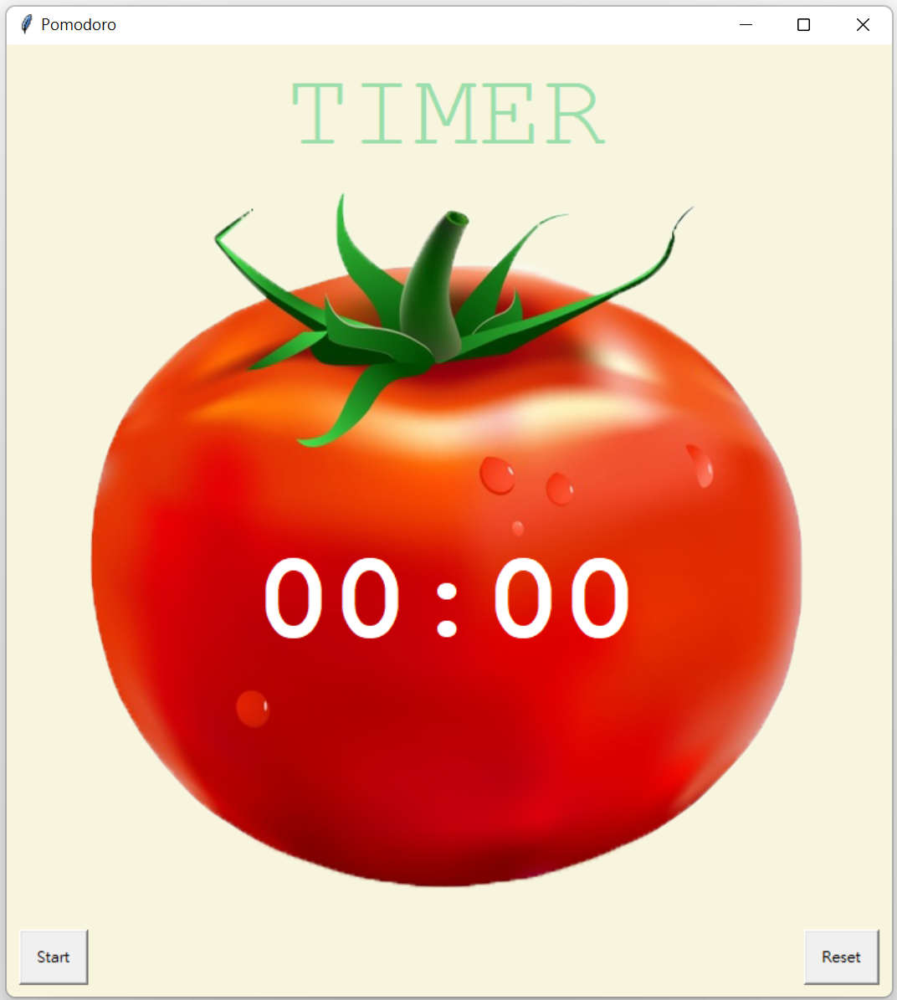

# <Strong>_Description_</Strong>

The Pomodoro Technique is a time management method developed by Francesco Cirillo in the late 1980s. It uses a timer to break work into intervals, typically 25 minutes in length, separated by short breaks. Each interval is known as a pomodoro, from the Italian word for tomato, after the tomato-shaped kitchen timer Cirillo used as a university student.

You have work on the task for 25 minutes. And then after that, you take a short 5 minutes break. And after you've done four of these Pomodoros, basically four repetition, then you get to take a long 20 minutes break.
 

# <Strong>_Tools & Git page_</Strong>

 
 
<strong>Git page: **https://github.com/LeonTsai2021 **</strong> 
 

 

# <Strong>_Features_</Strong>

## <Strong>_Home_</Strong>
When your answer is correct, the State would show on the picture. The top of input screen shows the number of the States you have figured out. 

## <Strong>_Guess_</Strong>
There is'nt necessary for you to write uppercase letter beginning. The program would automatically transform it.

 
